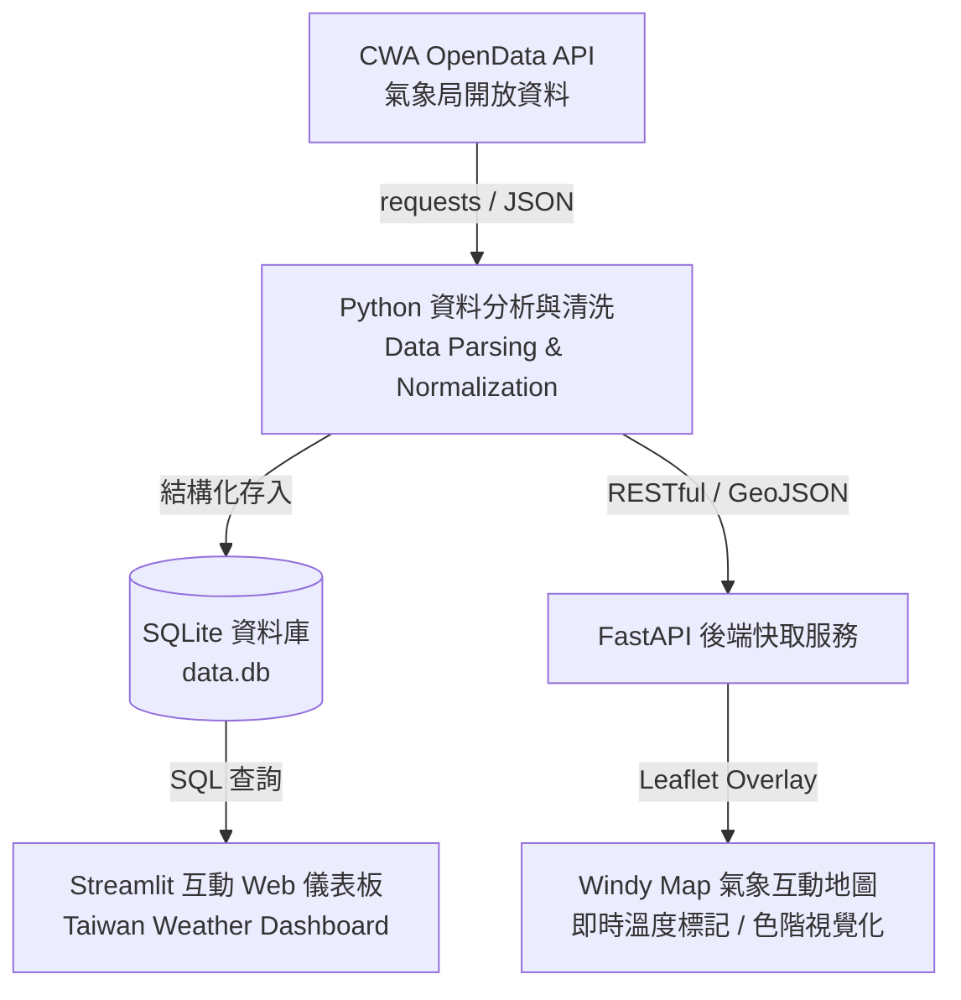

# 🌦️ Taiwan Weather Forecast & Visualization (AIoT L3 CWA)

本專案為 **AIoT L3 作業 — 台灣天氣預報與互動式氣溫視覺化系統 (Taiwan Weather Forecast System)**。  
整合 **中央氣象署開放資料 (CWA OpenData API)**、**Python 資料處理與分析**、**SQLite 本地資料庫**、**Streamlit 互動式 Web 應用**，以及進階的 **Windy Map Forecast API + Leaflet 地圖視覺化**。

---

## 📌 專案架構與核心流程 (Workflow)



---

## ✨ 主要功能與作業階段 (Key Features & Milestones)

### 1. 取得 CWA API 資料 (CWA API Ingestion)
- 串接中央氣象署 OpenData API（如一週天氣預報 `F-A0010-001` 與自動氣象觀測站資料）。
- 使用 `requests` 模組透過 HTTP Header 帶入授權碼 (Authorization Key) 取得 JSON 格式氣象數據。

### 2. 分析 JSON 氣象資料 (JSON Analysis & Parsing)
- 解析巢狀 JSON 結構 (`records -> locations -> location -> weatherElement`)。
- 萃取台灣六大區域（北部、中部、南部、東北部、東部、東南部地區）每日最高溫 (`MaxT`)、最低溫 (`MinT`) 與天氣概況。
- 資料驗證與清洗（過濾異常值、型別轉換、缺失值處理）。

### 3. 存入 SQLite 資料庫 (Database Storage)
- 建立 SQLite 資料表 `TemperatureForecasts`：
  ```sql
  CREATE TABLE TemperatureForecasts (
      id INTEGER PRIMARY KEY,
      regionName TEXT,
      dataDate TEXT,
      minT REAL,
      maxT REAL
  );
  ```
- 支援 SQL 查詢所有地區名稱與特定區域的逐日溫度預報資料。

### 4. Streamlit 氣象預報 Web App (Dashboard)
- **互動式選單**：支援下拉選擇欲查詢的台灣地區。
- **視覺化圖表**：以折線圖清楚呈現未來一週的最高溫與最低溫趨勢變化。
- **資料明細表格**：完整列出未來一週各日期的預測數據。

### 5. 進階視覺化：Windy Map + Leaflet 溫度覆蓋層 (Advanced Map Visualization)
- **Windy 地圖底圖**：以台灣為中心，整合風場、降雨、雲層等即時氣象圖層。
- **Leaflet 自訂標記**：將測站溫度依色階渲染為彩色圓形標記 (`L.circleMarker`)。
- **測站詳細資訊彈窗 (Popup)**：點擊測站即時顯示站名、所屬縣市行政區、即時溫度、濕度、風速及觀測時間。
- **溫度色階圖例 (Legend)**：
  - `< 10°C` 寒冷 (藍)
  - `10–20°C` 舒適/涼爽 (綠)
  - `20–30°C` 溫暖 (黃/橙)
  - `> 35°C` 炎熱/酷熱 (紅)

---

## 🛠️ 技術棧 (Tech Stack)

| 領域 | 技術 / 套件 | 說明 |
| :--- | :--- | :--- |
| **程式語言** | Python 3.10+ / TypeScript | 核心開發語言 |
| **資料來源** | CWA OpenData API | 氣象署開放資料平台 |
| **資料庫** | SQLite (`sqlite3`) | 輕量化本地關聯式資料庫 |
| **資料處理** | `pandas`, `requests`, `pydantic` | 資料抓取、清理、結構驗證 |
| **Web 應用** | `Streamlit` / `FastAPI` | 快速儀表板構建與 RESTful API |
| **地圖視覺化** | `Windy Map Forecast API`, `Leaflet`, `Folium` | 氣象地圖與即時圖層疊加 |

---

## 📁 建議專案目錄結構 (Project Structure)

```text
.
├── readme.md                   # 專案說明文件
├── requirements.txt            # Python 相依套件清單
├── fetch_weather.py            # CWA API 資料抓取腳本
├── parse_weather.py            # JSON 資料解析與清洗
├── database.py                 # SQLite 資料庫初始化與寫入
├── app.py                      # Streamlit 氣象預報 Web 主程式
├── backend/                    # (進階) FastAPI 後端服務
│   ├── app/
│   │   ├── main.py             # FastAPI 入口點
│   │   ├── routers/            # 路由模組 (temperature, health)
│   │   └── services/           # 業務邏輯 (cwa_client, cache_service)
│   └── .env.example            # 後端環境變數範例
└── frontend/                   # (進階) Windy + Leaflet 地圖前端
    ├── src/
    │   ├── components/         # WindyMap, TemperatureLayer, Legend
    │   └── lib/                # API 呼叫與色階工具
    └── package.json
```

---

## 🚀 快速開始 (Getting Started)

### 1. 取得 CWA API Key
前往 [中央氣象署開放資料平台](https://opendata.cwa.gov.tw/) 註冊並取得個人 API 授權碼 (Authorization Key)。

### 2. 安裝 Python 環境與套件
```bash
# 建立並啟用虛擬環境 (建議)
python -m venv .venv
# Windows:
.venv\Scripts\activate
# macOS/Linux:
source .venv/bin/activate

# 安裝所需套件
pip install -r requirements.txt
```

*常見所需套件：`requests`, `pandas`, `streamlit`, `folium`, `fastapi`, `uvicorn`*

### 3. 執行氣象資料處理流程
```bash
# 1. 抓取氣象局最新一週預報資料
python fetch_weather.py

# 2. 解析並寫入 SQLite 資料庫
python parse_weather.py
python database.py
```

### 4. 啟動 Streamlit 氣象儀表板
```bash
streamlit run app.py
```
啟動後瀏覽器會自動開啟 `http://localhost:8501` 查看互動式氣象預報圖表。

---

## 🔒 環境變數與安全規範 (Environment Variables & Security)
- **請勿將 API Key 直接硬編碼或提交至 Git 倉庫**。
- 建議將敏感資訊設定於 `.env` 檔案中，並加入 `.gitignore`。
```env
CWA_API_KEY=your_cwa_api_key_here
CACHE_TTL_SECONDS=600
```
