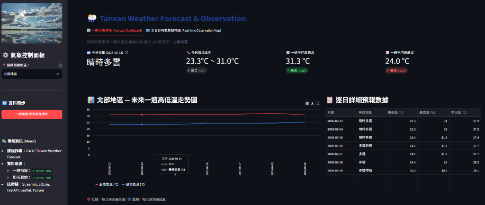
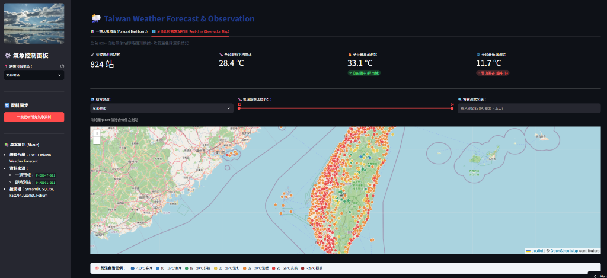
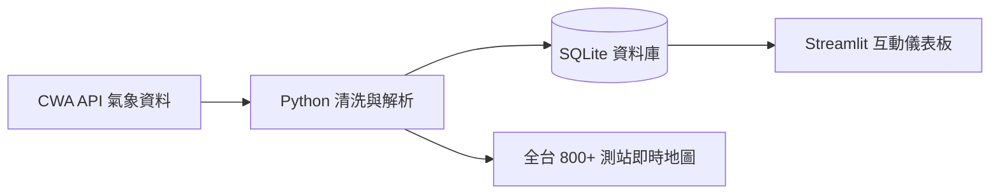

# 🌦️ 台灣天氣預報與即時氣溫視覺化系統
> **AIoT L3 HW10 Taiwan Weather Forecast**  
> 整合中央氣象署 (CWA) 開放資料、SQLite 資料庫與 Streamlit / Leaflet 互動式氣象儀表板。

---

## 📸 系統畫面展示 (Screenshots)

### 1. 📊 未來一週天氣預報與氣溫走勢儀表板


### 2. 🗺️ 全台 800+ 即時自動氣象站觀測地圖 (色階視覺化)


---

## 📌 系統架構與流程



---

## ✨ 核心功能

1. **氣象 API 資料擷取**：串接中央氣象署一週預報 (`F-D0047-091`) 與自動氣象站即時觀測 (`O-A0001-001`)。
2. **結構化資料清洗**：萃取全台 22 縣市與六大分區之每日最高溫 (`MaxT`)、最低溫 (`MinT`) 與天氣概況。
3. **SQLite 本地存儲**：建立 `TemperatureForecasts` 表格並提供高速 SQL 查詢介面。
4. **Streamlit 互動儀表板**：
   - 📍 **分區/縣市切換**：下拉選單即時查詢。
   - 📈 **氣溫走勢圖**：未來一週高低溫雙色折線圖。
   - 📋 **逐日數據表**：預報氣溫與天氣明細。
   - 🔄 **一鍵同步**：即時自氣象署更新最新數據。
5. **進階氣象地圖視覺化**：全台 800+ 測站氣溫色階渲染、詳細 Popup 彈窗、縣市與溫度區間篩選。

---

## 🚀 快速開始

### 1. 安裝套件
```bash
pip install -r requirements.txt
```

### 2. 啟動 Streamlit 氣象儀表板
```bash
python -m streamlit run app.py
```
> 啟動後於瀏覽器開啟 `http://localhost:8501` 即可使用。

### 3. (選用) 啟動 FastAPI 後端伺服器
```bash
python -m uvicorn backend_api:app --reload --port 8000
```

---

## 📁 專案檔案結構

```text
├── assets/                 # 系統截圖展示圖片
│   ├── forecast_dashboard.png
│   └── realtime_observation_map.png
├── app.py                  # Streamlit 氣象預報與地圖主程式
├── fetch_weather.py        # 擷取 CWA 一週預報資料
├── parse_weather.py        # 解析 JSON 結構並提取溫度
├── database.py             # SQLite 資料庫初始化與 SQL 查詢
├── fetch_cwa_stations.py   # 全台 800+ 即時氣象站觀測數據清洗
├── backend_api.py          # FastAPI RESTful / GeoJSON API 服務
├── windy_map.html          # 獨立 Leaflet 氣象地圖展示頁
├── requirements.txt        # Python 相依套件清單
├── workflow.md             # 詳細開發流程與實作規範文件
└── .env                    # CWA API Key 設定檔
```
