# 📋 Taiwan Weather Forecast — 開發工作流程指南 (Workflow Guide)

本文件詳細說明 **HW10 台灣天氣預報應用程式 (Taiwan Weather Forecast)** 與 **Windy + CWA 即時氣象視覺化系統** 的完整開發流程、步驟規範與實作指引。

---

## 🧭 開發流程地圖 (Workflow Pipeline)

```mermaid
graph LR
    subgraph S1["階段 1: 資料取得"]
        A1["CWA API 授權碼"] --> A2["requests 呼叫 API"]
        A2 --> A3["獲取原始 JSON 資料"]
    end

    subgraph S2["階段 2: 資料解析"]
        A3 --> B1["解析巢狀 records 結構"]
        B1 --> B2["萃取 6 大區域資料"]
        B2 --> B3["提取 MaxT / MinT 數值"]
    end

    subgraph S3["階段 3: 資料庫存儲"]
        B3 --> C1["建立 SQLite data.db"]
        C1 --> C2["寫入 TemperatureForecasts 表"]
        C2 --> C3["執行 SQL 查詢驗證"]
    end

    subgraph S4["階段 4: Web 應用呈現"]
        C3 --> D1["Streamlit 前端介面"]
        D1 --> D2["地區下拉選單 (Selectbox)"]
        D2 --> D3["一週高低溫折線圖 + 表格"]
    end

    subgraph S5["階段 5: 進階地圖整合"]
        D3 --> E1["Folium 台灣地圖視覺化"]
        E1 --> E2["FastAPI 後端 + Windy & Leaflet"]
    end
```



---

## 🛠️ 階段一：取得 CWA API 資料 (`fetch_weather.py`)

### 🎯 目標
透過中央氣象署 OpenData API 取得台灣六大區域之一週天氣預報（資料集代碼：`F-A0010-001`）。

### 📋 涵蓋區域
1. 北部地區
2. 中部地區
3. 南部地區
4. 東北部地區
5. 東部地區
6. 東南部地區

### 💻 核心實作範例
```python
import requests
import json

def fetch_cwa_weather_forecast(api_key: str) -> dict:
    """呼叫 CWA OpenData API 取得一週天氣預報資料"""
    url = "https://opendata.cwa.gov.tw/api/v1/rest/datastore/F-A0010-001"
    headers = {
        "Authorization": api_key
    }
    params = {
        "format": "JSON"
    }
    
    response = requests.get(url, headers=headers, params=params, timeout=10)
    response.raise_for_status()
    
    data = response.json()
    return data

if __name__ == "__main__":
    CWA_API_KEY = "YOUR_CWA_API_KEY"
    weather_data = fetch_cwa_weather_forecast(CWA_API_KEY)
    
    # 輸出確認
    print(json.dumps(weather_data, indent=2, ensure_ascii=False)[:500])
```

---

## 🔍 階段二：分析與清洗 JSON 氣象資料 (`parse_weather.py`)

### 🎯 目標
解析 CWA 回傳的巢狀結構，提取各區域逐日的最高溫 (`MaxT`) 與最低溫 (`MinT`)。

### 🧩 JSON 結構層級
```text
records
└── locations
    └── location (各區資料：北部、中部、南部...)
        └── weatherElement (天氣要素)
            ├── elementName: "MinT" (最低溫)
            │   └── time: [ { startTime, endTime, elementValue: [ { value } ] } ]
            └── elementName: "MaxT" (最高溫)
                └── time: [ { startTime, endTime, elementValue: [ { value } ] } ]
```

### 💻 解析邏輯範例
```python
import json
from typing import List, Dict, Any

def parse_forecast_data(raw_json: dict) -> List[Dict[str, Any]]:
    """解析 CWA JSON 資料為結構化列表"""
    parsed_results = []
    
    locations = raw_json["records"]["locations"]["location"]
    
    for loc in locations:
        region_name = loc["locationName"]
        
        # 建立按日期索引的暫存字典
        daily_temps = {}
        
        for element in loc["weatherElement"]:
            element_name = element["elementName"]
            
            if element_name in ["MinT", "MaxT"]:
                for t in element["time"]:
                    date_str = t["startTime"].split("T")[0] # 取 YYYY-MM-DD
                    val = float(t["elementValue"][0]["value"])
                    
                    if date_str not in daily_temps:
                        daily_temps[date_str] = {}
                    
                    if element_name == "MinT":
                        daily_temps[date_str]["minT"] = val
                    elif element_name == "MaxT":
                        daily_temps[date_str]["maxT"] = val
        
        # 組裝成結構化清單
        for data_date, temps in daily_temps.items():
            parsed_results.append({
                "regionName": region_name,
                "dataDate": data_date,
                "minT": temps.get("minT"),
                "maxT": temps.get("maxT")
            })
            
    return parsed_results
```

---

## 💾 階段三：存入 SQLite 資料庫 (`database.py`)

### 🎯 目標
將解析清洗後的結構化氣象數據寫入 SQLite 本地資料庫 `data.db`，並提供標準 SQL 查詢介面。

### 📊 資料庫表格結構 (`TemperatureForecasts`)
| 欄位名稱 | 類型 | 說明 |
| :--- | :--- | :--- |
| `id` | `INTEGER` | 主鍵 (Primary Key, Auto-increment) |
| `regionName` | `TEXT` | 地區名稱 (如: 北部地區) |
| `dataDate` | `TEXT` | 預報日期 (如: 2026-04-14) |
| `minT` | `REAL` | 最低溫度 (°C) |
| `maxT` | `REAL` | 最高溫度 (°C) |

### 💻 資料庫操作範例
```python
import sqlite3
from typing import List, Dict, Any

DB_NAME = "data.db"

def init_db():
    """初始化建立資料表"""
    with sqlite3.connect(DB_NAME) as conn:
        cursor = conn.cursor()
        cursor.execute("""
            CREATE TABLE IF NOT EXISTS TemperatureForecasts (
                id INTEGER PRIMARY KEY AUTOINCREMENT,
                regionName TEXT NOT NULL,
                dataDate TEXT NOT NULL,
                minT REAL,
                maxT REAL
            );
        """)
        conn.commit()

def save_forecasts(forecasts: List[Dict[str, Any]]):
    """批次寫入預報資料 (先清空舊資料再寫入)"""
    with sqlite3.connect(DB_NAME) as conn:
        cursor = conn.cursor()
        cursor.execute("DELETE FROM TemperatureForecasts;")
        cursor.executemany("""
            INSERT INTO TemperatureForecasts (regionName, dataDate, minT, maxT)
            VALUES (:regionName, :dataDate, :minT, :maxT);
        """, forecasts)
        conn.commit()

def query_regions() -> List[str]:
    """查詢所有地區名稱"""
    with sqlite3.connect(DB_NAME) as conn:
        cursor = conn.cursor()
        cursor.execute("SELECT DISTINCT regionName FROM TemperatureForecasts;")
        return [row[0] for row in cursor.fetchall()]

def query_region_forecast(region_name: str) -> List[tuple]:
    """查詢特定地區的一週溫度預報"""
    with sqlite3.connect(DB_NAME) as conn:
        cursor = conn.cursor()
        cursor.execute("""
            SELECT dataDate, minT, maxT
            FROM TemperatureForecasts
            WHERE regionName = ?
            ORDER BY dataDate ASC;
        """, (region_name,))
        return cursor.fetchall()
```

---

## 🖥️ 階段四：Streamlit 氣象預報 Web App (`app.py`)

### 🎯 目標
使用 Streamlit 建立互動式儀表板，提供使用者選擇地區並即時渲染趨勢圖與資料表格。

### 💻 儀表板實作範例
```python
import streamlit as st
import pandas as pd
import sqlite3

st.set_page_config(page_title="Taiwan Weather Forecast", page_icon="🌦️", layout="wide")

st.title("🌤️ Taiwan Weather Forecast — 台灣天氣預報儀表板")

# 1. 取得地區列表
conn = sqlite3.connect("data.db")
regions_df = pd.read_sql_query("SELECT DISTINCT regionName FROM TemperatureForecasts", conn)
region_list = regions_df["regionName"].tolist() if not regions_df.empty else ["北部地區"]

# 2. 互動下拉選單
selected_region = st.selectbox("請選擇欲查詢地區：", region_list)

# 3. 查詢所選地區之氣溫資料
query = """
    SELECT dataDate AS 日期, minT AS 最低溫, maxT AS 最高溫
    FROM TemperatureForecasts
    WHERE regionName = ?
    ORDER BY dataDate ASC
"""
df = pd.read_sql_query(query, conn, params=(selected_region,))
conn.close()

if not df.empty:
    # 4. 顯示統計指標與折線圖
    col1, col2 = st.columns([2, 1])
    
    with col1:
        st.subheader(f"📈 {selected_region} — 未來一週氣溫趨勢")
        chart_data = df.set_index("日期")
        st.line_chart(chart_data)
        
    with col2:
        st.subheader("📋 逐日預報數據")
        st.dataframe(df, use_container_width=True)
else:
    st.warning("⚠️ 目前資料庫中無資料，請先執行資料抓取與寫入腳本！")
```

---

## 🗺️ 階段五：進階地圖視覺化 (Map & Advanced Integration)

### 1. Folium 台灣地圖著色 (Optional)
- 依各縣市或區域平均氣溫 (`(minT + maxT) / 2`) 自動設定標記顏色：
  - `< 20°C` 藍色 (寒冷)
  - `20–25°C` 綠色 (舒適)
  - `25–30°C` 黃色 (溫暖)
  - `> 30°C` 紅色 (炎熱)

### 2. Windy Map Forecast API + Leaflet Overlay 擴充架構
```text
FastAPI 後端 (/api/temperature/latest)
    ├── 定時排程抓取 CWA 自動氣象站 (O-A0001-001) 資料
    ├── 數值清洗與記憶體快取 (TTL: 600s)
    └── 回傳標準 JSON / GeoJSON

前端 (Windy Map + Leaflet)
    ├── 初始化 Windy Map (中心座標: [23.7, 121.0], 縮放: 7)
    ├── 疊加 Leaflet LayerGroup 渲染 CWA 各測站圓形 Marker
    ├── 點擊 Marker 彈出 Popup（顯示測站名稱、溫度、濕度、風速、時間）
    └── 支援風場 / 雲層 / 降雨等底圖圖層切換
```

---

## ✅ 驗收與評分查核清單 (Grading & Verification Checklist)

| 階段 | 評分項目 | 滿分佔比 | 檢驗標準 |
| :--- | :--- | :---: | :--- |
| **1. API 資料獲取** | 取得 CWA API 資料 | 20% | 成功以 Header 傳遞授權碼取得 JSON 資料 |
| **2. 資料解析分析** | 分析 JSON 提取溫度 | 20% | 準確萃取六大區域之每日 MinT / MaxT |
| **3. 資料庫儲存** | 存入 SQLite 資料庫 | 20% | 資料庫結構正確，且能以 SQL 指令完整查詢 |
| **4. Web 應用構建** | Streamlit 氣象預報 App | 40% | 具備下拉選單、折線圖繪製、資料表格與整體版面流暢度 |
| **5. 進階加分** | 台灣地圖視覺化 | +Bonus | 整合 Folium 地圖或 Windy API 標記呈現 |
